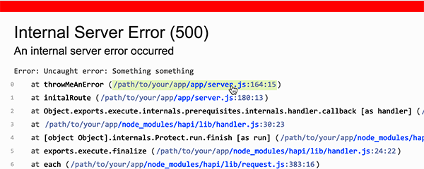

# hapi-dev-error-page

A helper for generating an error page that is friendly for developers.
It displays the error type, code, message and a formatted stack trace.
The files in the stack trace are linked to open up in your IntelliJ IDE.



```javascript
if (process.env.NODE_ENV === 'development') {
    const handleDevErrorPage = require('../hapi-dev-error-page');
    
    server.ext('onPreResponse', (request, reply) => {
        if (request.response.isBoom) {
            return handleDevErrorPage(request, reply);
        }
        
        reply.continue();
    });
}
``